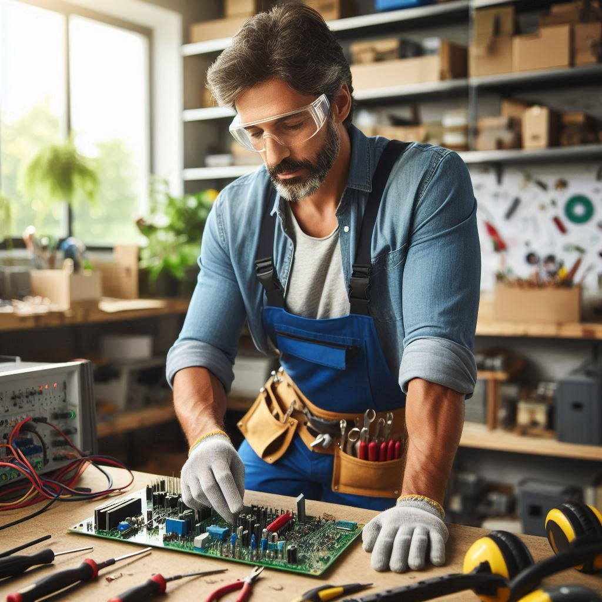

<!DOCTYPE html>
<html lang="es">
<head>
  <meta charset="UTF-8">
  <meta name="viewport" content="width=device-width, initial-scale=1.0">
  <title>Local Services AJ</title>

  <link rel="icon" href="aj.ico" type="image/x-icon">
  <link rel="shortcut icon" href="aj.ico" type="image/x-icon">
    
  
  <!-- Agregar FontAwesome para los íconos -->
  <link rel="stylesheet" href="https://cdnjs.cloudflare.com/ajax/libs/font-awesome/6.0.0/css/all.min.css">
</head>
<body>

  <!-- Enlace del Bot -->
   
  
  

  <!-- Header -->
  <header class="header">
    
Local Services AJ

    <nav class="nav">
      <a href="#inicio">Inicio</a>
      <a href="#Nuestros Servicios">Nuestros Servicios</a>
      <a href="#¿Como Funciona?">¿Como Funciona?</a>
      <a href="#Conocenos">Conocenos</a>
    </nav>
    

      <a href="#">Registrate</a>
      <a href="#">Login</a>
    

  </header>

<!-- Hero Section -->
<section id="inicio" class="hero">
  <video autoplay muted loop class="hero-video">
      <source src="video3.mp4" type="video/mp4">
      <!-- Agrega más fuentes aquí si tienes otros formatos de video -->
  </video>
  

      <h1>Conectando Clientes y Profesionales</h1>
      
El marketplace que conecta a profesionales locales con clientes que necesitan servicios rápidos, confiables y de calidad.

      

          <a href="#">Encuentra tu Profesional</a>
          <a href="#">Únete como Proveedor</a>
      

  

</section>

<!-- Sección Servicios -->
<section id="Nuestros Servicios" class="section">
  <h2>Nuestros Servicios</h2>
  

      

          
          <h3>Plomería</h3>
      

      

          
          <h3>Jardinería</h3>
      

      

          
          <h3>Limpieza</h3>
      

      

          
          <h3>Reparaciones</h3>
      

      

          
          <h3>Electricidad</h3>
      

  

</section>

    <!-- Sección ¿Cómo Funciona? -->
    <section id="¿Como Funciona?" class="section">
      <h2>¿Cómo Funciona?</h2>
      

        

          
          <h3>Para Clientes</h3>
          
🔍 Busca el servicio que necesitas.

          
👨‍🔧 Elige al profesional adecuado.

          
😊 Disfruta de un trabajo bien hecho.

        

        

          
          <h3>Para Proveedores</h3>
          
📝 Regístrate como proveedor.

          
📅 Publica tus servicios y horarios.

          
📈 Conecta con nuevos clientes.

        

      

      

    </section>

<!-- Sección Conócenos -->
<section id="Conocenos" class="section">
  <h2>Conócenos</h2>
  

      <!-- Subsección Historia -->
      

          <h3>📖 Historia</h3>
          
El 2 de junio de 2024, Andrey y Johanna unieron fuerzas para crear Local Services AJ, una empresa impulsada por la pasión de servir a su comunidad. Con una plataforma intuitiva, conectan a profesionales locales con clientes que buscan soluciones prácticas para el hogar y el negocio. Desde reparaciones hasta limpieza, Local Services AJ ofrece una amplia gama de servicios con calidad, transparencia y atención personalizada. Su objetivo es claro: contribuir al desarrollo local y mejorar la vida de sus vecinos.

      

      <!-- Subsección Misión -->
      

          <h3>🌱 Misión</h3>
          
Ofrecer servicios de plomería, jardinería, limpieza, reparaciones y electricidad de excelencia, superando las expectativas de nuestros clientes y contribuyendo al bienestar de sus hogares y negocios.

      

      <!-- Subsección Visión -->
      

          <h3>🌟 Visión</h3>
          
Transformar la forma en que las personas acceden a servicios de plomería, jardinería, limpieza, reparaciones y electricidad, mediante una plataforma innovadora que facilite la conexión entre clientes y profesionales, y garantice la calidad y la eficiencia en cada servicio.

      

      <!-- Subsección Valores Organizacionales -->
      

          <h3>🔑 Valores Organizacionales</h3>
          
Nuestros valores fundamentales son:

          <ul>
              <li><strong>Integridad:</strong> Actuamos con honestidad y transparencia en todas nuestras interacciones.</li>
              <li><strong>Compromiso:</strong> Nos dedicamos a proporcionar servicios de alta calidad a nuestros clientes.</li>
              <li><strong>Innovación:</strong> Buscamos constantemente nuevas formas de mejorar y ofrecer mejores soluciones.</li>
              <li><strong>Colaboración:</strong> Trabajamos en equipo para alcanzar objetivos comunes y ofrecer el mejor servicio.</li>
              <li><strong>Sostenibilidad:</strong> Nos esforzamos por tener un impacto positivo en la comunidad y el medio ambiente.</li>
          </ul>
      

  

  

</section>

  <!-- Footer -->
  <footer class="footer">
    
&copy; 2023 Local Services AJ. Todos los derechos reservados.

    <a href="#" class="whatsapp-button">Contáctanos por WhatsApp</a>
    <!-- Botones de redes sociales -->
    

      <a href="https://www.linkedin.com" class="linkedin" target="_blank">
        <i class="fab fa-linkedin"></i>
      </a>
      <a href="https://www.instagram.com" class="instagram" target="_blank">
        <i class="fab fa-instagram"></i>
      </a>
      <a href="https://www.twitter.com" class="twitter" target="_blank">
        <i class="fab fa-twitter"></i>
      </a>
      <a href="https://www.facebook.com" class="facebook" target="_blank">
        <i class="fab fa-facebook"></i>
      </a>
    

  </footer>

  <!-- Ícono de WhatsApp -->
  <a href="https://wa.me/573192592038" class="whatsapp-icon" target="_blank">
    <i class="fab fa-whatsapp"></i>
  </a>

</body>
</html>
